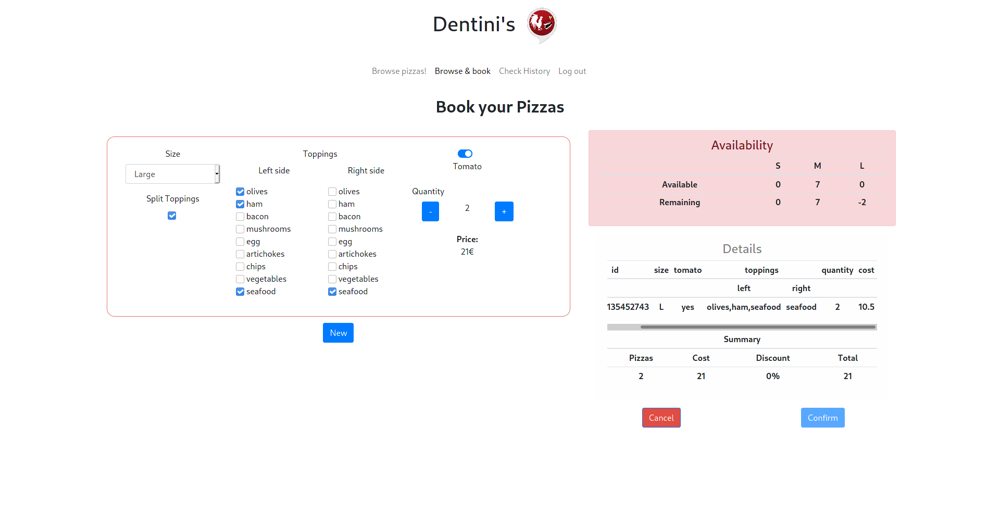

# Exam #4: "Pizza"
## Student: s267475 MALAN ERICH

## React client application routes

- Route `/public`: the page contains the information about the various pizzas that can be ordered, as well as their property (possible toppings, max number of toppings, tomato etc) and their availability on the store. It is achievable both from a logged User context or not.
- Route `/loading`: Route loaded and unloaded when the client is waiting for a server answer,  it just show a rotating image. Is for obvious reasons the only one that is not navigable from the header/Menu.
-  Route `/login`: The page is substantially a login form, there are 2 different input text areas where the user must provide his credential to access to the restricted area of the portal.
-  Route `/signup`: This page  allows the subscription of new user, very similar to the login form has 1 additional text area where the user must repeat the password, if they are different an alert is shown
-  Route `/book`:Only available in "authenticated mode", Book route shows the interface where the user can configure he's own order, by addid deleting and mofifying pizzas, which can be submitted in the end.
-  Route `/history`:Only available in "authenticated mode",Here the user can browse the past orders performed, a summary is presented which shows the number of pizzas and the cost, the details are fetched from the server when not already requested to avoid useless overloads of the Web traffic.
-  Route `/logout`:Only available in "authenticated mode", Simple logout page where the user can confirm the intention to logout.
## REST API server

- POST `/api/login`
  - request parameters:
  - - username: the email of the user
  - - password: the password associated to the email of the user
  - response body:
  - - id: the user id (an integer)
  - - email: the user email related to the id
- POST `/api/signup`
  - request parameters:
  - - username: the email of the user
  - - password: the password associated to the email of the user
  - - repwd: also the password which is checked to match the previous
  - response body:
  - - id: the user id (an integer)
  - - email: the user email related to the id
- POST `/api/logout`
- POST `/api/order`
  - request parameters:
  - - orders: the orders that the user submitted to be processed
  - - (user) user id
  - response body:
  - - msg: order successfull
  - - order: the id of the order processed
  - - user: the user's email
- GET `/api/pizzas/public`
  - response body:
  - - pizzas: the object contains the availability for each size of pizza
- GET `/api/user`
  - response body:
  - - id: the user id
  - - email: the user email
- GET `/api/history`
- response body:
  - - history: a nested object with the ids, the number of pizzas and cost of any past order of the user
  - - (user) user id
- GET `/api/history/:historyId`
  - request parameters:
  - - (params) the id of the order to fetch the details
  - - (user) user id
  - response body:
  - - history: a nested object with the ids, the number of pizzas and cost of any past order of the user

## Server database

- Table `USERS` - contains the id (autoincrement primary key), the user email and the hash of the password
- Table `PIZZAS` - contains the number of available pizzas for each size
- Table `ORDERS` - contains the order id (autoincrement primary key), the user who performed it, the number of pizzas, the total cost, and last the description of the order whith informations about each pizza requested

## Main React Components

- `HistoryEl` (in `HistoryEl.js`): used both from `HistoryList` and `OrderList`, shows the infos about an order (id, pizza, cost etc) may shot the details of the order if requested creating a child if type `OrderDetal`.
- `HistoryList` (in `HistoryList.js`): Show the performed orders of an user (if authenticated), creates elements of tipe `HistoryEl`.
- `LoginForm` (in `LoginForm.js`): Form that get as input the email(validated) and the password of an user and ask the submission.
- `SignupForm` (in `SignupForm.js`): Form that get as input the email, the password and the repeted password of an user and ask the submission, if the passwords do not match it show an alert.
- `Menu` (in `Menu.js`): Is the header of the application, it contains the link for the various routes.
- `OrderList` (in `OrderList.js`): Pratically the form that compose the `/book` route. It generates components of type `PizzaForm`, which are the configurators of pizzas, it allows the creations of new ones as well as the deletion, it shows the availability of the pizzas and the summary of the order and the sumbission/deletion. It shows the alert of the result of the order. Fetches the order result and the availability.
- `PizzaForm` (in `PizzaForm.js`): Is the configurator of an order component, it allows to change the parameters of a pizza but it validates them before.
- `RouteAccess` (in `RouteAccess.js`): Is a Route wrapper which defines if the user can walk the line or must be redirected.
- `PizzasList` (in `PizzasList.js`): fetches the pizzas and shows them through `PizzaEl` childs.

## Screenshot

## Test users

* pippo@topo.it, pluto5
* topolino@topo.it, loveYaMinnie
* paperino@topo.it, GreenPocket (frequent customer)
* nonna@papera.it, QQQducks
* qui@quo.it, dove?qua (frequent customer)
